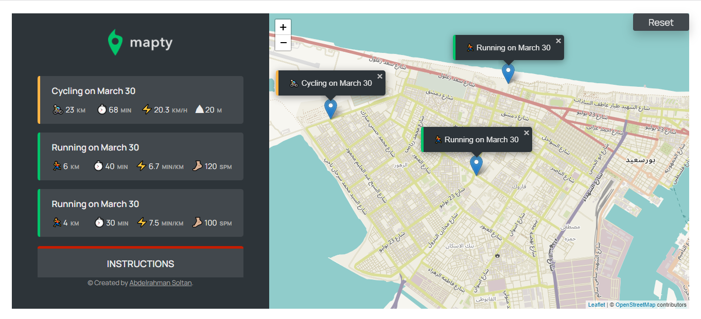

# Mapty

workouts logging page for Cycling and Running using map from "Leaflet library".

## Logic & Plan (flowchart)


## Mapty-architecture


## Preview



### To reset workouts: type this in the console

```
app.reset()
```
